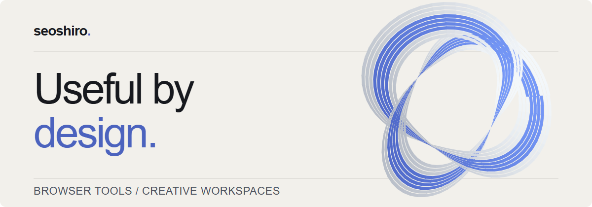
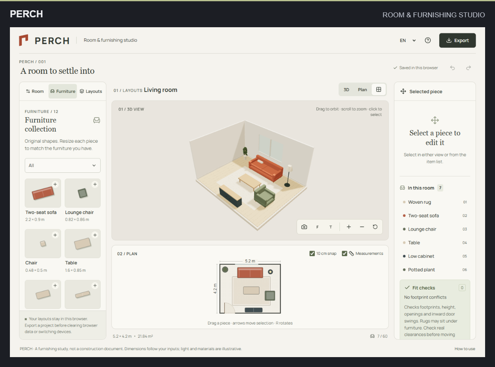

<picture>
  <source media="(prefers-color-scheme: dark)" srcset="assets/banner-dark.png">
  <source media="(prefers-color-scheme: light)" srcset="assets/banner-light.png">
  
</picture>

# Hi, I'm Beibars — seoshiro here.

I build browser tools for creative work and everyday problems. I care about interfaces that make the next step clear, local data you can keep, and exports you can use elsewhere.

**[Portfolio](https://seoshiro.github.io/)** · **[Selected work](#selected-work)** · **[All repositories](https://github.com/seoshiro?tab=repositories)**

## Selected work

### 01 / PERCH

**Try a few layouts before moving a single chair.** Set up a rectangular room, resize furniture to match what you own, and see the same layout in 2D and 3D. Compare independent alternatives and export the plan, a 3D image, or a printable report.

**[Open PERCH](https://seoshiro.github.io/perch-studio/)** · [Source](https://github.com/seoshiro/perch-studio) · [Case study](https://seoshiro.github.io/projects/perch.html)

React · TypeScript · Three.js · SVG · Local browser saves · EN / RU / KK

### 02 / SELVEDGE

**One graphic, a whole collection.** An apparel workroom for artwork placement, garment colors, and named revision comparison. Make a collection PNG, a PDF visual proof, or an editable project to continue later.

**[Open SELVEDGE](https://seoshiro.github.io/selvedge-studio/)** · [Source](https://github.com/seoshiro/selvedge-studio) · [Case study](https://seoshiro.github.io/projects/selvedge.html)

React · TypeScript · Canvas · IndexedDB · EN / RU / KK

### 03 / FORME

**From references to a direction.** Gather images and notes, compose a moodboard, and turn its colors and typography into a design kit. Take away PNG, CSS variables, design tokens, and a portable project.

**[Open FORME](https://forme-studio-coral.vercel.app/)** · [Source](https://github.com/seoshiro/forme-studio) · [Case study](https://seoshiro.github.io/projects/forme.html)

React · TypeScript · Web Workers · IndexedDB · Russian interface

### Tools for careful work

**[GuideCheck](https://seoshiro.github.io/guidecheck/)** — Compare instruction revisions and keep human review evidence attached to the steps it belongs to. Portable workspace backups; EN / RU / KK. [Source](https://github.com/seoshiro/guidecheck)

**[ArchiveGuard](https://seoshiro.github.io/archiveguard/)** — Compare JPEG capture metadata with Google Photos sidecars, resolve conflicts, and export checked copies with an audit trail. Original files stay untouched. [Source](https://github.com/seoshiro/archiveguard)

## What I work with

**Interfaces:** TypeScript, React, authored CSS, Vite. 
**Browser tools:** Three.js, SVG, Canvas, IndexedDB, Web Workers, Web Crypto. 
**Verification:** Playwright, unit tests, GitHub Actions.

The repositories document how each tool works, how it was checked, and where its limits are. The [portfolio](https://seoshiro.github.io/) brings those decisions together in English, Russian, and Kazakh.

<strong>Earlier engineering work</strong>

[**AituDesk**](https://github.com/seoshiro/aitudesk) — A college IT service desk with tickets, real-time chat, a multilingual knowledge base, and reporting.

[**AssetControl**](https://github.com/seoshiro/AssetControl) — Equipment inventory, handovers, repairs, and financial reporting.

