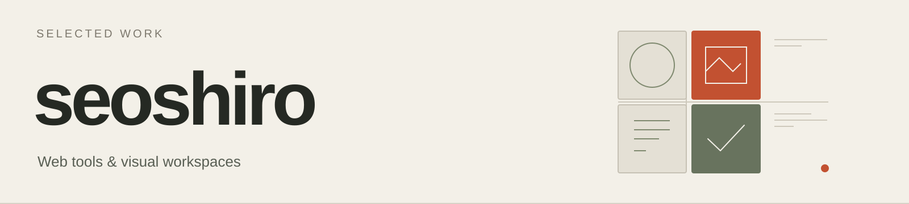

  

# Hi, I'm seoshiro.

I build web tools for creative work and everyday workflows, with clear interfaces, careful data handling, and useful exports.

**[Selected projects](#selected-projects)** · **[More repositories](https://github.com/seoshiro?tab=repositories)**

## Selected projects

### SELVEDGE

**An apparel collection proofing studio.** Place artwork on the front and back, explore colorways, and compare named revisions. Export a collection PNG, a PDF visual proof, or an editable project. Files and editing stay in the browser.

**[Open the studio ↗](https://seoshiro.github.io/selvedge-studio/)** · [Source](https://github.com/seoshiro/selvedge-studio) · [Product walkthrough](https://github.com/seoshiro/selvedge-studio#the-workroom)

React · TypeScript · IndexedDB · Canvas · English / Русский / Қазақша

### FORME

**A visual research and direction studio.** Collect references, compose an editable moodboard, and turn its colors and typography into a design kit. Export PNG, CSS variables, design tokens, and portable projects.

**[Open the studio ↗](https://forme-studio-coral.vercel.app/)** · [Source](https://github.com/seoshiro/forme-studio) · [Demo walkthrough](https://github.com/seoshiro/forme-studio#a-direction-in-motion)

React · TypeScript · Web Workers · IndexedDB · Canvas · Russian interface

### GuideCheck

Compare instruction revisions, record what a person actually tested, and keep corrections alongside review history. Browser workspace with portable backups; English, Russian, and Kazakh interfaces.

**[Try GuideCheck ↗](https://seoshiro.github.io/guidecheck/)** · [Source](https://github.com/seoshiro/guidecheck)

### ArchiveGuard

Review JPEG capture metadata against Google Photos JSON sidecars. Resolve conflicts explicitly and export new copies with an audit trail, while keeping original files untouched.

**[Try ArchiveGuard ↗](https://seoshiro.github.io/archiveguard/)** · [Source](https://github.com/seoshiro/archiveguard)

## In the code

**Interface:** React, TypeScript, authored CSS, Vite. 
**Browser work:** IndexedDB, Web Workers, Canvas, portable file formats. 
**Verification:** Playwright, unit tests, GitHub Actions.

The project repositories include setup instructions, architecture notes, verification records, and practical limits.

## Earlier work

[**AituDesk**](https://github.com/seoshiro/aitudesk) — a college IT service desk with tickets, real-time chat, a multilingual knowledge base, and reporting. 
[**AssetControl**](https://github.com/seoshiro/AssetControl) — equipment inventory, handovers, repairs, and financial reporting.
